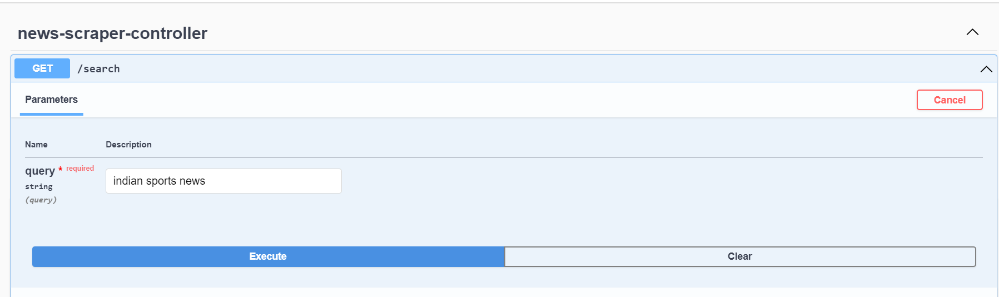
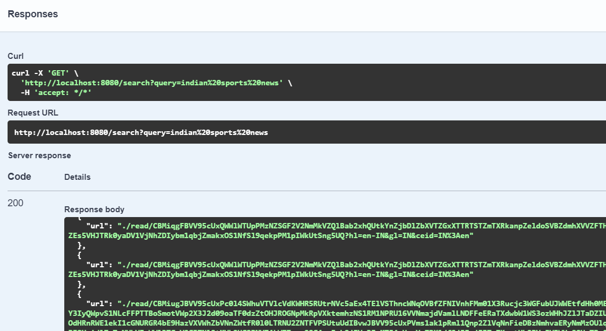

<h2 align="center">Service to Fetch News URLs from Google</h2>

News

----
### Overview
This project is a Java-based web scraping service designed to fetch news URLs from Google News based on a provided search term. It is built using Spring Boot to provide a robust and scalable architecture for web-based services, while Playwright handles the automation and interaction with web pages for scraping the relevant news data.


### Features

- Extract news URLs from Google News using Playwright to ensure accurate and fast data retrieval.
- Spring Boot RESTful service that fetches news articles based on user search queries.
environments.
- Scalable architecture capable of handling multiple concurrent user requests.
- Configurable search parameters and scraping intervals for flexibility in search and scheduling.
- Swagger UI integration for easy API testing and documentation.
- Automated browser control to manage browser sessions for scraping using Playwright.


### Prerequisites

- Java 21
- Maven
- Playwright (installed via dependency)

### Dependencies:- 
- Spring Web
- Spring Actuator
- maven-plugin
- Playwright 
- swagger version 2.1.0

#### Clone the Repository

git clone https://github.com/iamaniketg/NewsApp.git
cd news-scraper
```
### Running the Application
```bash
mvn spring-boot:run
```
### Servers

http://localhost:8080 - Generated server url


### Request URL

http://localhost:8080/search?query=indian%20sports%20news

### Swagger URL
Access the Swagger UI for interactive API documentation:
http://localhost:7575/api/news/swagger-ui/index.html#/news-controller/fetchNews
### Curl :-
-curl -X 'GET' \
  'http://localhost:8080/search?query=indian%20sports%20news' \
  -H 'accept: */*'

  # Project Documentation

## input  section




## output  section




### Licence:- 
- This project is licensed under the MIT License.


<!-- Contact -->
## Summary
Create an HTTP API endpoint /fetchNews that uses Selenium to search Google News for a given term. Extract news article URLs from the search results using XPath queries. The service accepts a search term via a query parameter, processes it to get the news URLs, and returns them in a JSON format. Manage the browser lifecycle manually and deploy the service to a cloud provider for public access.
- Maild Id :  deepak76311@gmail.com

<h1 align="center">Thank You...<h1>
<h3 align = "center"> 